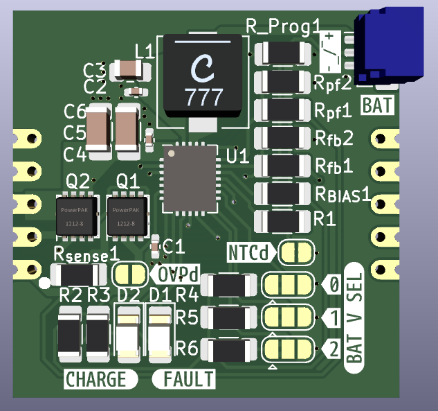

# DC_UPS_LTC4040
Low power Uninterrupible Power Supply based on the LTC4040

*The LTC4040 is a complete 3.5V to 5.5V supply rail battery backup system. It contains a high current step-up DC/DC regulator to back up the supply from a single-cell Li-Ion or LiFePO4 battery.*
Picked from the datasheet.

So yeah, This is supposed to be a place in module for Low Power systems that need to keep functioning when power goes off. The dimensions of the module are 30 x 30 mm, and it can be configured (as stated in the datasheet) to support different battery chemistries, and to disable or enable features like Overvoltage protection or Temperature Control of the battery

Everything is described in the schematic:

And the board design is Included:

The board hasn't been tested yet, so take with care. 
Also I do not take any responsability or problems that may arrise with its use

### Proyects that may arrise Interest to the readers:
- [The Ultimate Single Cell Lithium UPS for any Raspberry Pi](https://hackaday.io/project/162653/logs?sort=oldest)
- [LTC4040 5V, 2.5A Uninterruptible Power Supply (UPS) with USB-C](https://www.beyondlogic.org/ltc4040-5v-2-5a-uninterruptible-power-supply-ups-with-usb-c/)
